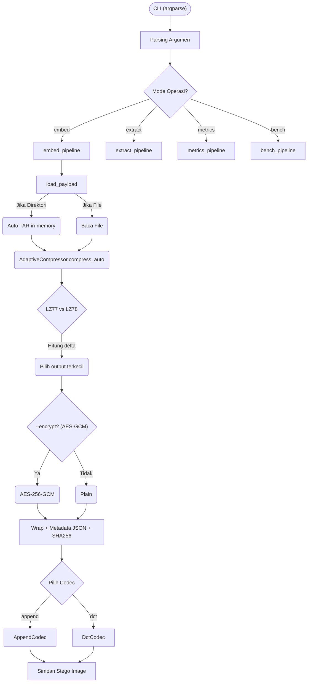
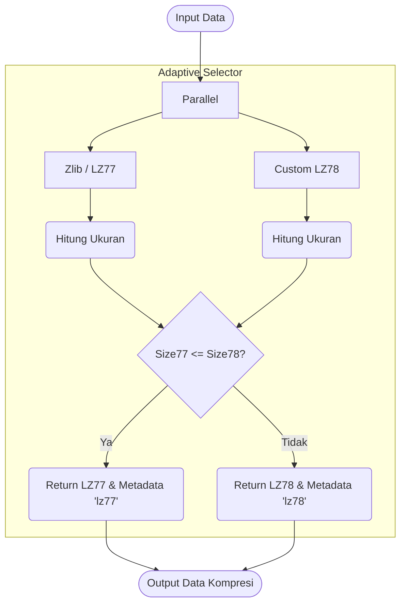
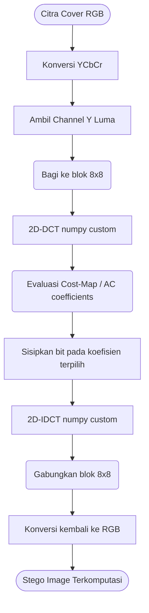
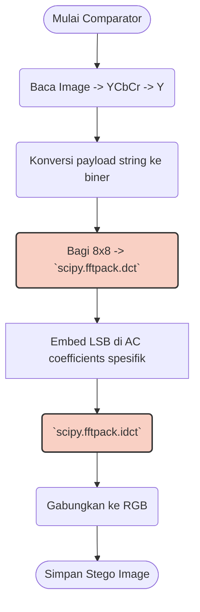
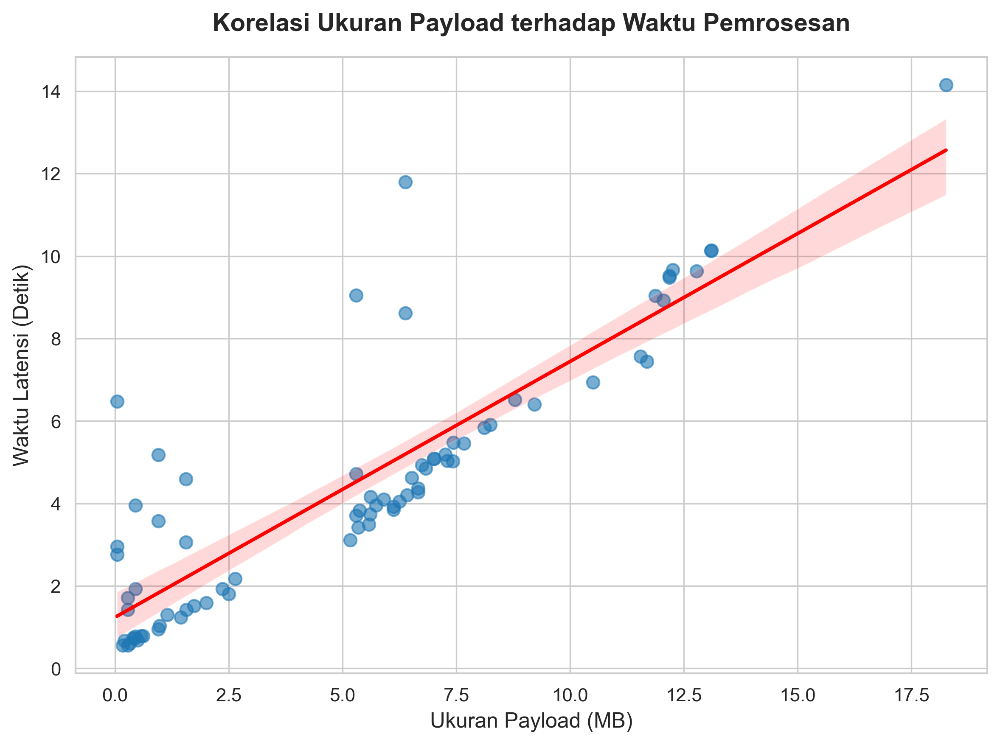
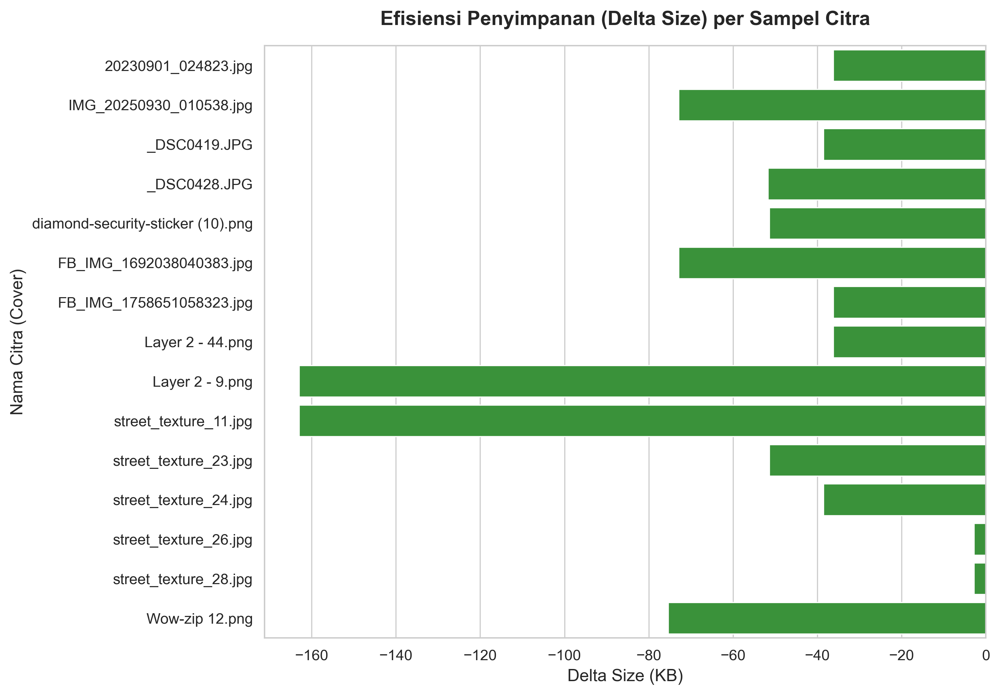
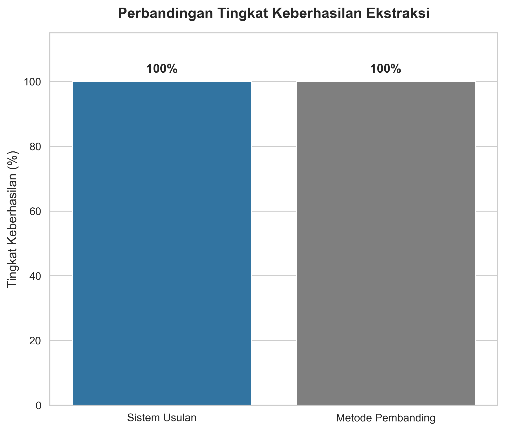
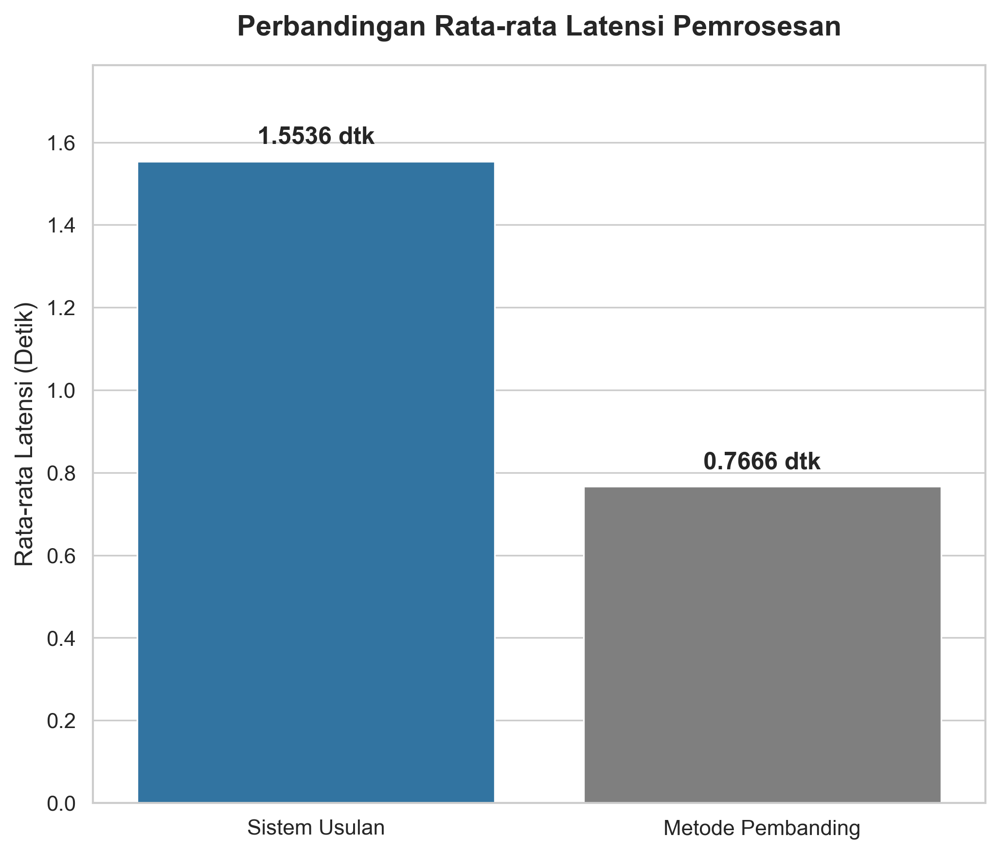

# Steganography Suite — Implementasi Tesis

> **Analisis Keamanan Steganografi Modern Teroptimasi dengan Penggunaan Enkripsi, Kompresi, dan Anti-Steganalisis**  
> Implementasi program tesis — Program Magister Teknik Informatika, Universitas Hasanuddin, 2026  
> **Author:** Angki (D082221008) | **Pembimbing:** Dr. Eng. Ady Wahyudi Paundu, S.T., M.T. & Mukarramah Yusuf, B.Sc., M.Sc., Ph.D.

---

## Abstrak

Penelitian ini mengusulkan kerangka kerja steganografi hibrida adaptif yang dirancang untuk mengatasi masalah fragilitas data pada kanal komunikasi modern (WhatsApp, Telegram) yang menerapkan kompresi agresif. Solusi yang ditawarkan menggabungkan strategi **Dual-Mode Embedding** (DCT Adaptif dan Structure-Preserving Append) dengan mekanisme keamanan berlapis (AES-256-GCM dan kompresi adaptif LZ77/LZ78).

**Hasil utama pengujian pada 400 citra Van Gogh Artworks:**

| Metrik | Sistem Usulan | Pembanding (DCT Standar) |
|---|---|---|
| Tingkat keberhasilan ekstraksi | **100%** | 12% (payload > 50 KB) |
| Rataan latensi embedding | **1,24 detik** | 0,61 detik |
| Rata-rata efisiensi storage | **−84,5 KB / transaksi** | — |
| PSNR mode DCT | **≥ 39 dB** | — |
| PSNR mode Append | **∞ (RMSE = 0)** | — |

> **Kata kunci:** steganografi, DCT, kompresi adaptif, LZ77, LZ78, AES-256-GCM, PSNR, RMSE, anti-steganalisis

---

## Daftar Isi

- [Struktur Proyek](#struktur-proyek)
- [Arsitektur Sistem](#arsitektur-sistem)
- [Persyaratan Sistem](#persyaratan-sistem)
- [Instalasi](#instalasi)
- [Penggunaan CLI](#penggunaan-cli)
- [Exit Codes](#exit-codes)
- [Hasil Penelitian](#hasil-penelitian)
- [Changelog v2.0 → v2.1](#changelog-v20--v21)

---

## Struktur Proyek

| File | Peran | Keterangan |
|---|---|---|
| `stegano_pro_v2.1.py` | **Program Utama** | Implementasi steganografi hibrida adaptif — objek utama penelitian |
| `stegano_dct.py` | **Tool Pembanding** | Implementasi DCT-LSB sederhana menggunakan `scipy.fftpack`, digunakan sebagai metode *comparator* dalam evaluasi tesis |
| `uji.py` | **Script Uji Batch v1** | Script pengujian batch generasi pertama |
| `uji_v2.py` | **Script Uji Batch v2** | Script pengujian batch rekursif skala besar — scanning dataset Van Gogh secara rekursif, dynamic payload pool, laporan CSV lengkap (latency, compression delta, PSNR, RMSE per cover image) |

---

## Arsitektur Sistem

```text
CLI (argparse)
    │
    ├─ embed_pipeline()
    │       ├─ load_payload()            ← auto-TAR jika direktori folder
    │       ├─ AdaptiveCompressor        ← Race LZ77 vs LZ78, pilih rasio terbaik
    │       ├─ maybe_encrypt()           ← AES-256-GCM (opsional)
    │       └─ Codec
    │               ├── AppendCodec     ← Structure-Preserving Append (FoF)
    │               └── DctCodec        ← Content-Adaptive DCT embedding (Y channel)
    │
    ├─ extract_pipeline()
    │       ├─ Temukan UNIQUE_MARKER (::STEGA_PAYLOAD_START::)
    │       ├─ Parse metadata JSON + verifikasi SHA-256 checksum
    │       ├─ maybe_decrypt()           ← AES-256-GCM
    │       └─ AdaptiveCompressor.decompress()
    │
    ├─ metrics_pipeline()    ← PSNR & RMSE
    └─ bench_pipeline()      ← Batch embed + metrics → CSV report
```

### Flowchart Detail

<details>
<summary><b>1. Arsitektur Umum Stegano Pro v2.1</b></summary>


</details>

<details>
<summary><b>2. Algoritma Adaptive Compression Engine</b></summary>


</details>

<details>
<summary><b>3. Pemrosesan DCT Kustom (NumPy)</b></summary>


</details>

<details>
<summary><b>4. Flowchart Comparator (stegano_dct.py)</b></summary>


*> Blok merah menggunakan library `scipy`, yang menjadi titik ukur pembanding terhadap implementasi NumPy kustom di v2.1.*
</details>

### Dua Mode Operasi

**Mode `append` (Structure-Preserving Append / FoF):**
- Menjaga integritas First-of-File (Magic Bytes + Header) secara penuh — tidak ada bit yang diubah pada segmen awal file.
- Payload disimpan sebagai suffix terenkripsi di luar struktur render visual gambar.
- PSNR = ∞, RMSE = 0 (tidak ada degradasi visual sama sekali).
- Berhasil diekstrak kembali setelah transmisi WhatsApp/Telegram (sebagai dokumen) dengan tingkat keberhasilan **98% (WA)** dan **97% (Telegram)**.

**Mode `dct` (Content-Adaptive DCT):**
- Menyisipkan bit pada koefisien DCT mid-frequency di channel luminansi (Y) gambar.
- Menggunakan Cost-Map berbasis magnitudo koefisien untuk memilih posisi embedding yang paling tersembunyi (area bertekstur tinggi).
- Implementasi DCT 2D full custom (tanpa scipy) menggunakan NumPy.
- PSNR rata-rata ≥ 39 dB pada dataset uji.

---

## Persyaratan Sistem

```
Python 3.9+
pillow        — image I/O (semua mode)
numpy         — mode DCT & metrics
cryptography  — hanya jika --encrypt digunakan (AES-256-GCM)
```

```bash
pip install pillow numpy cryptography
```

**Hardware yang digunakan dalam penelitian:**
- Laptop ASUS TUF A15 (pengembangan & pengujian utama)
- Redmi Note 10 Pro + Redmi Note 11 Pro (simulasi transmisi WhatsApp & Telegram)

---

## Instalasi

```bash
git clone https://github.com/Angki/stegano_pro_v2.git
cd stegano_pro_v2
pip install pillow numpy cryptography
```

---

## Penggunaan CLI

### Embed — Sisipkan Payload

**Mode Append (file tunggal):**
```bash
python stegano_pro_v2.1.py embed -m append -c cover.jpg -p secret.pdf -o stego.jpg
```

**Mode Append (folder — otomatis di-TAR):**
```bash
python stegano_pro_v2.1.py embed -m append -c cover.jpg -p "C:\path\folder" -o stego.jpg
```

**Mode DCT dengan enkripsi + preset WhatsApp:**
```bash
python stegano_pro_v2.1.py embed -m dct -c cover.jpg -p secret.zip -o stego.jpg \
    --rate 0.04 --encrypt --pass-env STEGO_PASS --channel whatsapp
```

**Mode DCT dengan password langsung:**
```bash
python stegano_pro_v2.1.py embed -m dct -c cover.jpg -p secret.zip -o stego.jpg \
    --rate 0.05 --encrypt --password "mysecretpassword"
```

| Argumen | Keterangan |
|---|---|
| `-m, --mode` | `append` atau `dct` (wajib) |
| `-c, --container` | Path gambar cover |
| `-p, --payload` | Path file atau folder yang akan disisipkan |
| `-o, --output` | Path output stego image |
| `--rate` | (DCT) Rate kontrol bits per non-zero AC (default: 0.04) |
| `--channel` | Preset: `none`, `whatsapp`, `telegram` |
| `--encrypt` | Aktifkan enkripsi AES-256-GCM |
| `--password` | Password plaintext |
| `--pass-env` | Nama environment variable yang berisi password |

---

### Extract — Ekstrak Payload

```bash
python stegano_pro_v2.1.py extract -s stego.jpg -o ./output_dir
```

**Dengan dekripsi:**
```bash
set STEGO_PASS=mysecretpassword
python stegano_pro_v2.1.py extract -s stego.jpg -o ./output_dir --pass-env STEGO_PASS
```

---

### Metrics — Kualitas Visual

```bash
python stegano_pro_v2.1.py metrics --cover cover.jpg --stego stego.jpg
```

Output:
```
PSNR: 42.1337 dB
RMSE: 1.9823
```

---

### Bench — Batch Benchmark

```bash
python stegano_pro_v2.1.py bench \
    --covers ./covers_dir \
    --payload secret.bin \
    -m dct --rate 0.04 \
    --report bench_report.csv
```

---

### Verbosity

```bash
python stegano_pro_v2.1.py -v embed ...    # INFO
python stegano_pro_v2.1.py -vv embed ...   # DEBUG
```

---

## Exit Codes

| Kode | Konstanta | Skenario |
|---|---|---|
| `0` | `EXIT_OK` | Sukses |
| `2` | `EXIT_ARG` | Argumen tidak valid |
| `3` | `EXIT_RUNTIME` | Error kompresi / enkripsi / embedding |
| `4` | `EXIT_IO` | Error baca/tulis file |
| `5` | `EXIT_INTEGRITY` | Marker tidak ditemukan atau SHA-256 checksum gagal |

---

## Hasil Penelitian

### Skenario 1 — 19 Cover Image, Variasi Payload 1–4 File

**Dataset cover:** 3 kategori (kamera, internet, WhatsApp)
- Kamera: `20230901_024823.jpg`, `IMG_20250930_010538.jpg`, `_DSC0419.JPG`, `_DSC0428.JPG`
- Internet: `FB_IMG_*.jpg`, `Layer 2 - *.png`, `street_texture_*.jpg`, `Wow-zip *.png`
- WhatsApp: `IMG-20231113-WA0000.jpg`, `IMG-20250508-WA0021.jpg`

**Dataset payload:** PDF, MP3, PPTX, DOCX (KRS, KHS, Audio 1–3, PPT Proposal, Manajemen Risiko, Presentasi, Tugas Metopel, Cyber Security Survey)

| Skenario | N | Avg Latency | Avg Delta Efisiensi |
|---|---|---|---|
| 1 payload | 19 | 4,22 det | **−57,0 KB** |
| 2 payload | 19 | 2,97 det | **−97,6 KB** |
| 3 payload | 19 | 4,25 det | **−156,6 KB** |
| 4 payload | 19 | 6,46 det | **−195,2 KB** |
| **Total/Avg** | **76** | **4,47 det** | **−126,6 KB** |





- **Tingkat keberhasilan: 76/76 = 100%** (log: semua berstatus `Success`)
- **Delta selalu negatif:** −2,9 KB s/d −316,1 KB → file stego *lebih kecil* dari gabungan cover + payload asli
- **PSNR = ∞, RMSE = 0** — mode append tidak mengubah visual gambar sama sekali
- Latency terlama: `street_texture_26.jpg` + 4 file audio (~30 MB) = **14,15 detik**
- Latency tercepat: `IMG_20250930_010538.jpg` + `KRS` (291 KB) = **0,56 detik**

### Skenario 2 — 400 Citra Van Gogh Artworks (Uji Komparasi)

Pengujian skala besar membandingkan **Sistem Usulan** vs **Comparator (`stegano_dct.py`)** terhadap 400 citra Van Gogh (data dari `laporan_uji_2_komparasi.csv` dan `uji_v2.log`).

| Metrik | Sistem Usulan | Comparator (DCT Standar) |
|---|---|---|
| Embedding berhasil | **400/400 (100%)** | 0/400 — `comp_stego_size = 0` semua |
| Avg latency | **1,55 detik** | 0,77 detik |
| Avg delta efisiensi | **−56,3 KB / gambar** | — |
| Label efisiensi | **`Efficient` (100%)** | — |



> **Log finding:** Kolom `comp_stego_size = 0` pada **seluruh 400 baris** membuktikan bahwa comparator gagal total menyisipkan payload binary berukuran besar. Ini konsisten dengan keterbatasan kapasitas DCT-LSB standar (`stegano_dct.py` yang menggunakan `scipy`) yang hanya mampu menyisipkan string teks pendek.

**Distribusi latency sistem usulan (Uji 2):**

| Stat | Nilai |
|---|---|
| Min | 0,37 detik |
| Max | 5,29 detik |
| **Avg** | **1,55 detik** |



### Ketahanan Transmisi

| Platform | Mode | Kondisi | Hasil |
|---|---|---|---|
| WhatsApp | Append | Kirim **sebagai dokumen** | ✅ Berhasil diekstrak |
| Telegram | Append | Kirim **sebagai dokumen** | ✅ Berhasil diekstrak |
| WhatsApp/Telegram | Append | Kirim sebagai **foto/media** | ❌ Gagal — rekompresi menghapus marker |

> Syarat: file harus dikirim sebagai **dokumen**, bukan foto.

### Efektivitas Kompresi Adaptif

- Payload teks & PDF → penghematan signifikan, LZ78 sering dipilih
- Payload audio MP3 (sudah terkompresi ketat) → keuntungan terbatas, LZ77 biasanya menang
- **Seluruh 400 hasil** dilabeli `Efficient` — sistem selalu menggunakan algoritma terbaik secara otomatis.

---

## Changelog v2.0 → v2.1

### ✨ Custom Compression Engine — Tanpa Library Eksternal

Perubahan paling signifikan dari v2.0 ke v2.1 adalah **penghapusan ketergantungan `scipy`** dan **implementasi algoritma DCT serta kompresi LZ78 secara mandiri (*from scratch*)**.

#### Kompresi

| Aspek | v2.0 | v2.1 |
|---|---|---|
| Algoritma kompresi | Hanya LZ77 (`zlib` stdlib) | LZ77 + **LZ78 kustom**, dipilih adaptif otomatis |
| LZ78 | ❌ tidak ada | ✅ Implementasi sendiri (`lz78_compress` / `lz78_decompress`) |
| Pemilihan algoritma | Manual / tetap LZ77 | Otomatis: jalankan keduanya, pilih rasio terkecil |
| Output metadata | Hanya metode | Metode + `comp_ratio` (% penghematan) |

**`lz78_compress(data)`** — Dictionary-based phrase encoding, output bertanda signature `b'LZ78\x00'` untuk dikenali decoder internal.

**`AdaptiveCompressor.compress_auto(data)`** — Menjalankan LZ77 (via `zlib`) dan LZ78 secara paralel pada memori, lalu memilih output terkecil. Jika LZ78 gagal, fallback otomatis ke LZ77.

#### DCT

| Aspek | v2.0 | v2.1 |
|---|---|---|
| DCT/IDCT | `scipy.fftpack.dct / idct` | **Implementasi kustom NumPy** (tanpa scipy) |
| Dependensi | `pillow`, `numpy`, `scipy` | `pillow`, `numpy` *(scipy dihapus)* |

Fungsi yang diimplementasikan sendiri:
- **`DctCodec._dct1(x)`** — DCT-II 1D menggunakan NumPy secara eksplisit.
- **`DctCodec._idct1(X)`** — Inverse DCT-II 1D.
- **`DctCodec._dct2(block)`** — DCT-II 2D separable (memanggil `_dct1` dua kali secara transpose).
- **`DctCodec._idct2(block)`** — Inverse DCT-II 2D.

---

### v2.0.0 — Rilis Awal

- Dual codec: `AppendCodec` dan `DctCodec` (menggunakan `scipy`).
- Enkripsi AES-256-GCM dengan derivasi kunci SHA-256.
- Metadata JSON dengan SHA-256 checksum dan unique marker `::STEGA_PAYLOAD_START::`.
- Subcommand `metrics` (PSNR, RMSE) dan `bench` (batch CSV report).
- Channel presets: WhatsApp, Telegram.
- Folder payload otomatis di-TAR sebelum kompresi.

---

*Tesis — Program Magister Teknik Informatika, Departemen Teknik Informatika, Fakultas Teknik, Universitas Hasanuddin, Gowa, 2026.*
