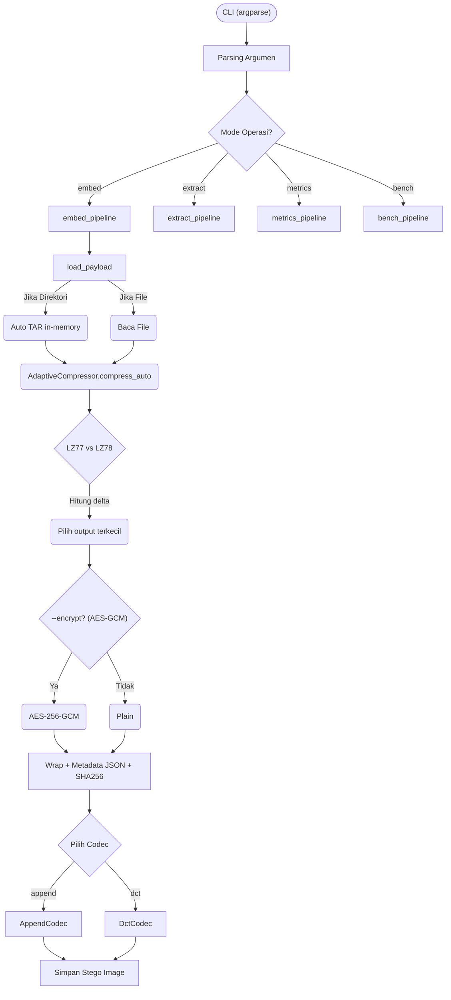
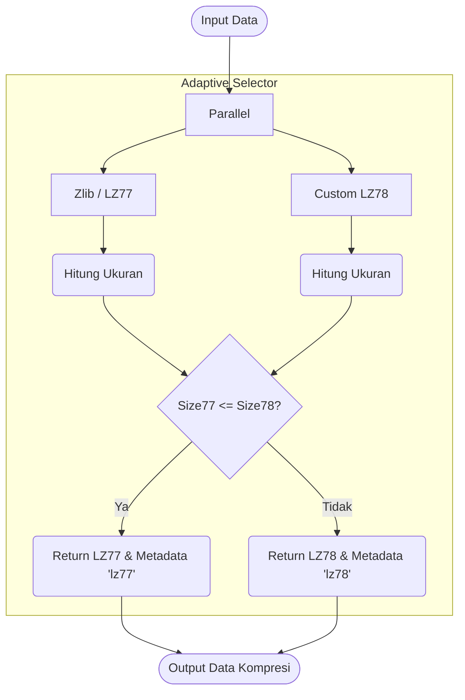
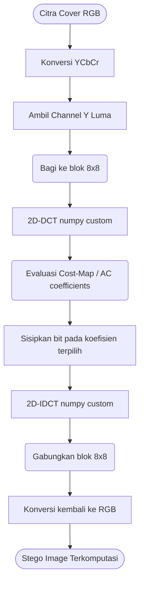
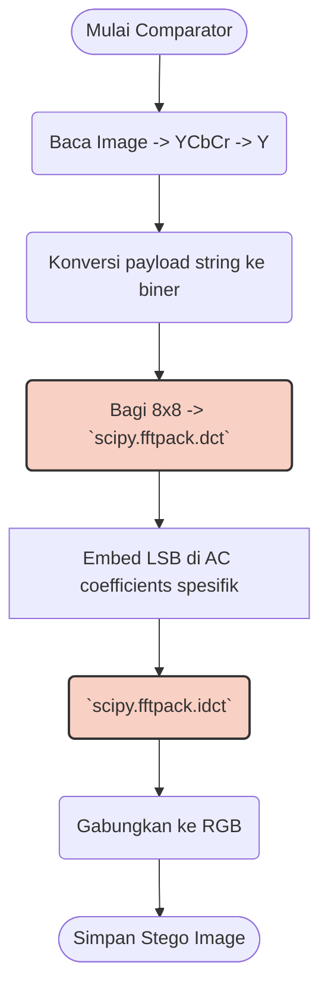

# Flowchart Sistem

Dokumen ini berisi diagram alur (flowchart) untuk memvisualisasikan cara kerja komponen utama dalam proyek **Steganography Suite v2.1**. Semua diagram menggunakan sintaks Mermaid.

<b>1. Arsitektur Umum Stegano Pro v2.1</b>

<b>2. Algoritma Adaptive Compression Engine</b>

<b>3. Pemrosesan DCT Kustom (NumPy)</b>

<b>4. Flowchart Comparator (stegano_dct.py)</b>

*> Blok merah menggunakan library `scipy`, yang menjadi titik ukur pembanding terhadap implementasi NumPy kustom di v2.1.*

